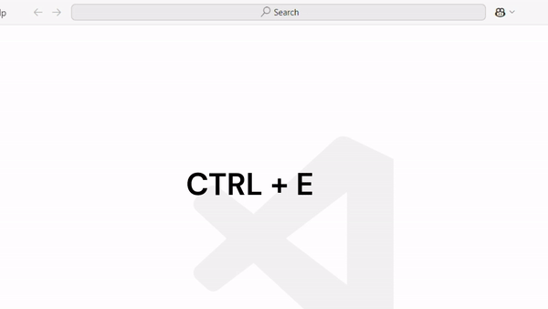

# Auto Theme Switcher

Automatically switch between given dark and light theme based on your time zone

## Configuration

Simply run the autoThemeSwitcher.configure command to configure the extension.

## Features

This extension lets you

- Set a light and dark theme, a time zone
- Automatically switch theme based on sunrise and sunset times calculated from your time zone

## Extension Settings

This extension contributes the following settings:

- `autoThemeSwitcher.lightTheme`: The light theme to switch to during the day
- `autoThemeSwitcher.darkTheme`: The dark theme to switch to during the night
- `autoThemeSwitcher.timezone`: Your timezone based on city for sunrise and sunset calculations

## Release Notes

### 1.0.0

Initial release
